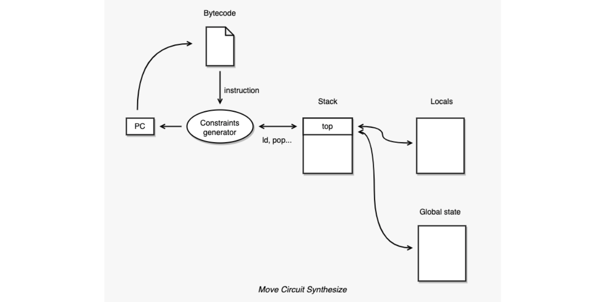

## zkMove Lite

zkMove Lite is a lightweight zero-knowledge proof friendly Move language virtual machine. Move bytecode is automatically "compiled" into circuit by the virtual machine. The circuit is application specific, and we call it a Move circuit.

## License

zkMove is licensed as [Apache 2.0](./LICENSE).